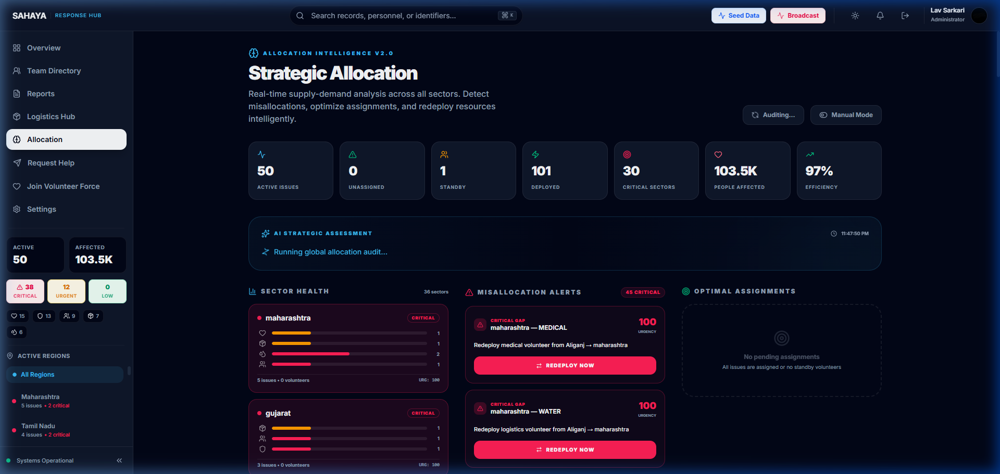
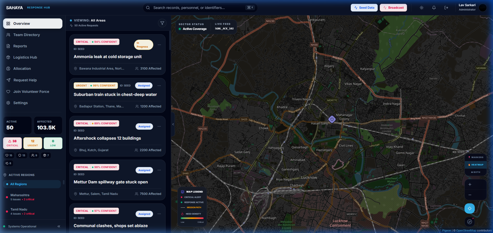

<div align="center">

<br/>


# SAHAYA

### Intelligent Aid Coordination Platform

[](https://react.dev)
[](https://firebase.google.com)
[](https://ai.google.dev)
[](https://typescriptlang.org)
[](https://vitejs.dev)

<br/>

**Sahaya** bridges the gap between people in need and available volunteers through<br/>
high-speed, compassionate, AI-driven coordination.

*The core problem isn't scarcity — it's misallocation. Resources exist, but they're poorly distributed<br/>
due to fragmented data across NGOs, social groups, and field operations.*

<br/>

[Getting Started](#-getting-started) •
[Features](#-features) •
[Architecture](#-architecture) •
[Tech Stack](#-tech-stack) •
[Contributing](#-contributing)

<br/>

</div>

---

<br/>

## 📸 Screenshots

<div align="center">

### Tactical Command Center


<sub>Real-time crisis overview with live issue feed, interactive tactical map, priority triage, and regional intelligence sidebar</sub>

<br/><br/>

### Strategic Allocation Dashboard


<sub>AI-driven resource allocation engine — sector health matrix, misallocation alerts, and one-click redeployment</sub>

<br/><br/>

### Heatmap Intelligence Layer


<sub>Canvas-rendered demand density heatmap with 3-mode layer toggle (Markers / Heatmap / Both)</sub>

</div>

<br/>

---

<br/>

## 🧠 The Problem

> **NGOs and social groups operate in silos.** Data from food drives, blood donation campaigns, disability programs, and field reports all exist separately. There is no unified system to aggregate this information.

Sahaya doesn't try to create resources from thin air. It solves the **misallocation problem** — the fact that resources exist but are invisible to the people who need them most. By aggregating fragmented data sources into a single operational picture, coordinators gain the visibility to make intelligent redeployment decisions.

### Platform Model

Sahaya is a **unified coordination platform** — not a tool for one individual NGO. Think of it as the **central command layer** that sits above multiple organizations:

```
┌─────────────────────────────────────────────────────┐
│              SAHAYA PLATFORM (Admin Layer)           │
│   • Sees ALL data across orgs                        │
│   • AI-driven allocation engine                      │
│   • Deploy volunteers across sectors                 │
└──────────────────────┬──────────────────────────────┘
                       │ aggregates
    ┌──────────────────┼──────────────────────┐
    ▼                  ▼                      ▼
┌─────────┐     ┌───────────┐          ┌──────────┐
│ NGO A   │     │ NGO B     │          │ Field    │
│ (food   │     │ (medical  │   ...    │ Reporter │
│  drives)│     │  camps)   │          │ (public) │
└─────────┘     └───────────┘          └──────────┘
```

- **Admins** (district coordinators / umbrella orgs) → see everything, run allocations
- **Volunteers** → see only their assigned tasks and field portal
- **Reporters** (NGO workers / public) → can only submit reports and apply to volunteer

### Without Sahaya
```
Food Drive Data ──────── ❌ No visibility
Medical Camp Data ────── ❌ Separate systems
Blood Donation Data ──── ❌ Paper records
Field Reports ────────── ❌ Scattered WhatsApp groups
NGO Partner Data ─────── ❌ Different databases
```

### With Sahaya
```
Food Drive Data ──────┐
Medical Camp Data ────┤
Blood Donation Data ──┼──▶ 🧠 Unified Intelligence ──▶ 🎯 Smart Allocation
Field Reports ────────┤
NGO Partner Data ─────┘
```

<br/>

---

<br/>

## ✨ Features

### 🎯 Smart Resource Allocation Engine
The beating heart of Sahaya. A pure-computation allocation service that:
- **Computes sector-level health** — Groups issues by region, calculates per-category demand, urgency scores, and health status (`critical` / `strained` / `balanced` / `surplus`)
- **Detects 3 types of misallocation:**
  - `CRITICAL_GAP` — Unassigned high-priority issues with no nearby volunteers
  - `SKILL_MISMATCH` — Volunteers deployed outside their specialization
  - `SURPLUS` — Over-allocated sectors that could redistribute resources
- **N:M optimal matching** — Weighted greedy algorithm using Haversine distance, skill compatibility, and issue urgency
- **One-click redeployment** — Admins can approve and execute suggested reallocations instantly

### 🤖 Gemini AI Intelligence
- **Signal Analysis** — Incoming reports are analyzed by Gemini to extract structured crisis data (category, priority, risk assessment, confidence score)
- **Duplicate Detection** — AI-powered signal merging prevents redundant reports from the same crisis
- **Global Audit** — Strategic natural-language assessment of the entire allocation landscape
- **Smart Matching** — Context-aware volunteer-to-task matching based on skills, availability, and proximity

### 🗺️ Tactical Map & Heatmap
- **Interactive map** with real-time issue markers, spatial clustering, and volunteer tracking
- **Canvas-based heatmap** layer rendering demand density with radial gradients
- **3-mode toggle** — Switch between Markers, Heatmap, or Both views
- **Mission paths** — Visual connections between en-route volunteers and their assigned crises
- **Fly-to animations** — Smooth animated transitions when selecting regions or issues

### 👥 Personnel Command
- **Volunteer vetting** — Multi-step application process with skill assessment and background fields
- **Real-time status tracking** — See volunteer positions, active tasks, and deployment status
- **Admin control center** — Approve applications, assign tasks, manage the entire volunteer force
- **Role-based access** — Admins, volunteers, and reporters each see only what they need

### 📊 Multi-Source Data Aggregation
- **6 data source types** — Field Report, Food Drive, Medical Camp, Blood Donation, Disability Program, NGO Partner
- **Source tagging** on every report with visual badges in the issue feed
- **Organization tracking** for NGO partner submissions
- **AI signal fusion** — Multiple reports about the same crisis are automatically merged with accumulated impact data

### ⚙️ Autopilot Mode
- **Manual Approval** (default) — All AI-suggested redeployments require admin sign-off
- **Autopilot** — High-confidence suggestions (>85%) execute automatically; high-risk actions still require approval
- Configurable in Settings → Allocation Mode (admin only)

### 📦 Logistics Hub
- Real-time inventory tracking across supply categories
- Resource management and distribution monitoring

<br/>

---

<br/>

## 🏗️ Architecture

```
┌─────────────────────────────────────────────────────────────────┐
│                        SAHAYA PLATFORM                          │
├─────────────────────────────────────────────────────────────────┤
│                                                                  │
│  ┌──────────┐  ┌──────────────┐  ┌──────────────────────────┐  │
│  │ Firebase  │  │ Gemini AI    │  │ Allocation Engine        │  │
│  │ Firestore │◀▶│ Signal Intel │◀▶│ Sector Matrix            │  │
│  │ Auth      │  │ Global Audit │  │ Misallocation Detection  │  │
│  │ Real-time │  │ Smart Match  │  │ N:M Optimal Assignment   │  │
│  └──────────┘  └──────────────┘  │ Heatmap Generation       │  │
│       ▲                           └──────────────────────────┘  │
│       │                                      ▲                   │
│       ▼                                      │                   │
│  ┌──────────────────────────────────────────────────────────┐   │
│  │                    React UI Layer                         │   │
│  │  ┌──────────┐ ┌───────────┐ ┌───────────┐ ┌──────────┐  │   │
│  │  │ Command  │ │ Strategic │ │ Tactical  │ │ Report   │  │   │
│  │  │ Center   │ │ Allocator │ │ Map+Heat  │ │ + Feed   │  │   │
│  │  └──────────┘ └───────────┘ └───────────┘ └──────────┘  │   │
│  │  ┌──────────┐ ┌───────────┐ ┌───────────┐ ┌──────────┐  │   │
│  │  │ Personnel│ │ Logistics │ │ Volunteer │ │ Settings │  │   │
│  │  │ Manager  │ │ Hub       │ │ Portal    │ │ + Auth   │  │   │
│  │  └──────────┘ └───────────┘ └───────────┘ └──────────┘  │   │
│  └──────────────────────────────────────────────────────────┘   │
└─────────────────────────────────────────────────────────────────┘
```

### Data Flow

```
Reporter submits crisis ──▶ Gemini analyzes signal ──▶ Structured issue created
                                                              │
                                    ┌─────────────────────────┘
                                    ▼
                           Allocation Engine runs
                           ┌────────────────────┐
                           │ Sector Matrix       │──▶ Health visualization
                           │ Gap Detection       │──▶ Alert generation
                           │ Optimal Assignment  │──▶ Deploy suggestions
                           │ Heatmap Points      │──▶ Canvas rendering
                           └────────────────────┘
                                    │
                        Admin approves / Autopilot auto-executes
                                    │
                                    ▼
                           Volunteer deployed to crisis
```

<br/>

---

<br/>

## 🛠️ Tech Stack

| Layer | Technology | Purpose |
|-------|-----------|---------|
| **Framework** | React 19 + TypeScript | Component architecture with type safety |
| **Build** | Vite 6 | Lightning-fast HMR and optimized builds |
| **Styling** | TailwindCSS 4 | Utility-first with custom dark theme |
| **Animation** | Motion (Framer) | Fluid micro-interactions and page transitions |
| **Maps** | Pigeon Maps | Lightweight interactive mapping with clustering |
| **Database** | Firebase Firestore | Real-time NoSQL with transaction support |
| **Auth** | Firebase Auth | Email/password + Google OAuth |
| **AI** | Google Gemini | Signal analysis, matching, and strategic audit |
| **Icons** | Lucide React | Consistent, premium iconography |
| **Routing** | React Router v7 | URL-based navigation with RBAC |
| **Server** | Express + TSX | Development server with API proxy |

<br/>

---

<br/>

## 🚀 Getting Started

### Prerequisites

- **Node.js** v18+
- **Firebase** project with Firestore + Auth enabled
- **Gemini API key** from [Google AI Studio](https://aistudio.google.com)

### Installation

```bash
# Clone the repository
git clone https://github.com/LavSarkari/project-sahaya.git
cd project-sahaya

# Install dependencies
npm install
```

### Environment Setup

Create a `.env.local` file in the root:

```env
GEMINI_API_KEY=your_gemini_api_key_here
```

Firebase config is in `src/firebase.ts` — update with your project credentials.

### Run Locally

```bash
npm run dev
```

The app will be available at `http://localhost:3000`

### Build for Production

```bash
npm run build
npm run preview
```

### Deploy Firestore Rules

```bash
firebase deploy --only firestore:rules
```

<br/>

---

<br/>

## 🔐 Security & Access Control

Sahaya implements **3-layer defense-in-depth** access control:

### Layer 1: Firebase Auth + Role Assignment
- New signups default to `reporter` role — **no one gets admin access by registering**
- Admin role is restricted to a **hardcoded whitelist** of authorized emails
- Auth via Email/Password or Google OAuth

### Layer 2: Route Guards (Client)
- `RequireRole` component wraps protected routes — unauthorized users see an "Access Restricted" screen
- Non-admins are redirected away from admin URLs even if typed manually
- Sidebar nav items only render for authorized roles

### Layer 3: Firestore Security Rules (Server)
- Field-level validation with strict type checking on all collections
- `settings` collection: write-restricted to admin role
- `users` collection: users can only modify their own document

### Role Permissions Matrix

| Feature | Admin | Volunteer | Reporter |
|---------|:-----:|:---------:|:--------:|
| Command Center (Overview) | ✅ | ❌ | ❌ |
| Strategic Allocation | ✅ | ❌ | ❌ |
| Team Directory | ✅ | ❌ | ❌ |
| Logistics Hub | ✅ | ❌ | ❌ |
| Reports Dashboard | ✅ | ❌ | ❌ |
| Autopilot Settings | ✅ | ❌ | ❌ |
| Volunteer Tasks Portal | ✅ | ✅ | ❌ |
| Submit Crisis Report | ✅ | ✅ | ✅ |
| Apply as Volunteer | ✅ | ✅ | ✅ |
| Settings (Personal) | ✅ | ✅ | ✅ |

<br/>

---

<br/>

## 📁 Project Structure

```
src/
├── components/
│   ├── LandingPage.tsx          # Public-facing landing page
│   ├── LoginPage.tsx            # Authentication portal
│   ├── MapView.tsx              # Tactical map + heatmap layer
│   ├── IssueFeed.tsx            # Live crisis feed with source badges
│   ├── IssueDetail.tsx          # Deep-dive incident view
│   ├── IssueComments.tsx        # Tactical communication log
│   ├── ReportIssue.tsx          # AI-powered crisis submission
│   ├── StrategicAllocation.tsx  # Smart allocation dashboard
│   ├── PersonnelManager.tsx     # Admin volunteer management
│   ├── VolunteerView.tsx        # Volunteer task portal
│   ├── VolunteerApplication.tsx # Volunteer application form
│   ├── LogisticsHub.tsx         # Supply chain management
│   ├── Settings.tsx             # User settings + autopilot
│   ├── Sidebar.tsx              # Navigation + live stats
│   └── TopNav.tsx               # Header + global search
├── services/
│   ├── aiService.ts             # Gemini integration + audit
│   ├── allocationService.ts     # Allocation computation engine
│   ├── issueService.ts          # Firestore CRUD + subscriptions
│   └── userService.ts           # User management + roles
├── contexts/
│   └── AuthContext.tsx           # Global auth state provider
├── types.ts                     # TypeScript type definitions
├── constants.ts                 # App constants + seed data
├── firebase.ts                  # Firebase initialization
└── App.tsx                      # Root routing + RBAC
```

<br/>

---

<br/>

## 🤝 Contributing

Contributions are welcome! Please:

1. Fork the repository
2. Create a feature branch (`git checkout -b feature/amazing-feature`)
3. Commit your changes (`git commit -m 'Add amazing feature'`)
4. Push to the branch (`git push origin feature/amazing-feature`)
5. Open a Pull Request

<br/>

---

<br/>

<div align="center">

### Built with purpose.

**Sahaya** (सहाया) means *"help"* in Hindi.

Every line of code serves one mission:<br/>
*Getting the right help to the right people, faster.*

<br/>

<sub>Made with ❤️ for communities that need it most</sub>

<br/><br/>

</div>
