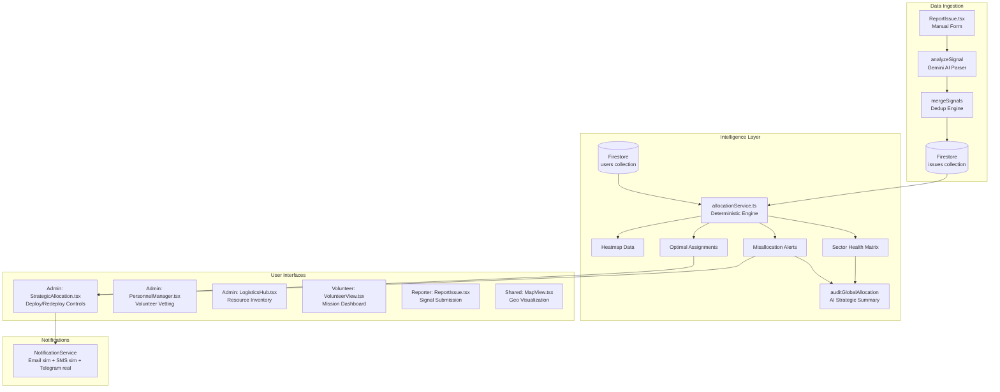
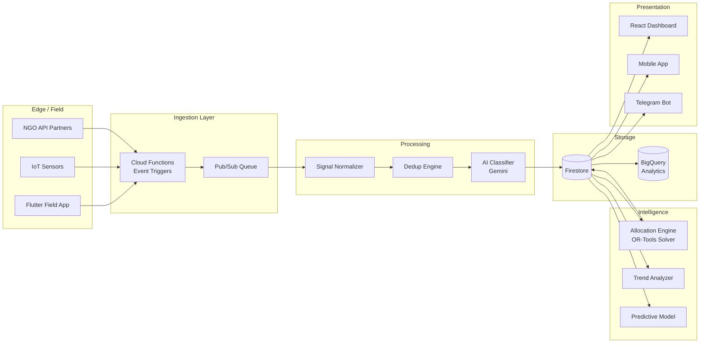

# Project Sahaya — Deep System Analysis
### Smart Resource Allocation: Data-Driven Volunteer Coordination for Social Impact

---

## PHASE 1: SYSTEM CLASSIFICATION

### Verdict: ⚠️ Partial Smart Allocation (Leaning Strong)

| Criterion | Status | Evidence |
|---|---|---|
| Multi-source data aggregation | ✅ Partial | 6 `DataSource` types (field_report, food_drive, medical_camp, blood_donation, disability_program, ngo_partner). But ingestion is **manual form-only** — no API connectors, no scraping, no batch import. |
| Data normalization | ✅ Yes | Gemini AI (`analyzeSignal`) parses raw text → structured `{title, category, priority, confidence}`. Spam filtering included. |
| Visibility (dashboards/maps) | ✅ Yes | Leaflet MapView with marker clustering, StrategicAllocation dashboard with sector health matrix, KPI bar, and heatmap data generation. |
| Urgency-based prioritization | ✅ Yes | Weighted urgency formula: `highPriority * 25 + totalDemand * 10 + floor(totalAffected / 50)`. Not just listing — actively ranks sectors. |
| Intelligent volunteer matching | ✅ Yes | Dual-layer: (1) Deterministic greedy algorithm in `allocationService.ts` with `score = skill*0.4 + proximity*0.3 + urgency*0.3`, (2) AI-based matching via Gemini in `aiService.ts`. |
| Signal deduplication | ✅ Yes | `mergeSignals` uses AI to detect if a new report describes an existing situation, then aggregates `signalCount`, `peopleAffected`, and `confidence`. |

### Why Not "True Intelligent"

1. **No feedback loop** — The system never learns from past allocations. No outcome tracking (was the volunteer effective? did the issue get worse?).
2. **No automated data pipelines** — Every data point enters through a single manual form. No API ingestion from NGOs, government feeds, or sensor networks.
3. **Allocation is advisory, not autonomous** — The system *recommends* assignments but requires admin click-to-deploy. The "Autopilot" toggle is **a UI button that does nothing** — it's state (`autopilot`) that is never consumed by any logic.
4. **Static sector definitions** — `AREAS` is a hardcoded array of 6 Lucknow neighborhoods. The system cannot dynamically discover or create sectors based on incident clustering.
5. **No temporal intelligence** — No trend detection, no forecasting, no "this area is getting worse" predictive alerts.

---

## PHASE 2: ARCHITECTURE BREAKDOWN

### Component Map



### Layer-by-Layer Assessment

#### 1. Data Ingestion — Grade: C+

| What Works | What's Missing |
|---|---|
| AI-powered signal parsing with spam filter | No API endpoints for external systems |
| Multi-source tagging (6 DataSource types) | No batch import / CSV upload |
| GPS geolocation capture | No web scraping of news/social media |
| Signal deduplication via AI merge | No IoT/sensor integration |
| Image upload capability | No structured intake from partner NGOs |

> [!WARNING]
> The system claims to aggregate from "multiple fragmented sources" but in reality, **every single data point enters through one React form**. The `DataSource` field is just a dropdown label — there's no actual pipeline behind `ngo_partner` or `medical_camp`.

#### 2. Data Processing — Grade: B+

- **Strengths**: Gemini-powered NLP parses free-text into structured signals. Confidence scoring. Spam rejection with reasons.
- **Weakness**: Processing is synchronous and client-side. If Gemini API fails or rate-limits, the entire submission pipeline breaks. No queue, no retry, no fallback classifier.

#### 3. Storage / Schema — Grade: B-

**Collections**: `issues`, `users`, `volunteer_applications`, `resources`, `notifications_log`, `settings`

| Issue | Impact |
|---|---|
| No composite Firestore indexes defined | `firestore.indexes.json` is empty — compound queries will fail at scale |
| No `resolved_at` timestamp | Cannot compute resolution time or SLA compliance |
| No `assignment_history` | Cannot track how many volunteers were tried before resolution |
| No `feedback` or `outcome` field | No way to close the feedback loop |
| `confidence` stored as 0-1 on Issue, but 0-100 in UI | Inconsistent representation |
| Area coordinates hardcoded in `utils.ts` | Not stored in Firestore; cannot scale beyond 6 areas |

#### 4. Intelligence Layer — Grade: B+

This is the strongest part of the system. Two distinct engines:

**Engine A — Deterministic (`allocationService.ts`, 410 lines)**
- `computeSectorMatrix()` — Sector health with demand/supply per category
- `detectMisallocations()` — Finds CRITICAL_GAP, SURPLUS, SKILL_MISMATCH
- `computeOptimalAssignments()` — Greedy weighted matching (skill 40%, proximity 30%, urgency 30%)
- `generateHeatmapData()` — Intensity = priority 50% + affected 30% + recency 20%
- `computeAllocationStats()` — Allocation efficiency = % of HIGH issues covered
- Uses Haversine distance for geo-proximity

**Engine B — AI-Powered (`aiService.ts`, 336 lines)**
- `matchVolunteerToTask()` — Gemini analyzes skills, bios, coordinates
- `auditGlobalAllocation()` — Strategic natural-language assessment
- `analyzeTacticalDepth()` — 3-step action plans per incident
- In-memory cache with 1-hour TTL for token optimization

#### 5. Visualization — Grade: B+

- Interactive Leaflet map with animated pan/zoom
- Sector health matrix with demand bars per category
- KPI dashboard with 7 real-time metrics
- Misallocation alert cards with one-click redeploy
- Optimal assignment cards with match % scores

**Missing**: Canvas-rendered heatmap (data generated but not rendered), historical trend charts, comparative analytics.

#### 6. User Layer — Grade: A-

Three well-separated roles with RBAC:
- **Admin**: Full dashboard, strategic allocation, personnel management, logistics
- **Volunteer**: Mission view, task acceptance, status updates
- **Reporter**: Signal submission with AI review

---

## PHASE 3: INTELLIGENCE GAP ANALYSIS

### Scoring Model Evaluation

| Component | Implementation | Quality |
|---|---|---|
| **Urgency Scoring** | `highPriority * 25 + demand * 10 + floor(affected / 50)` | ⚠️ Decent but missing: recency decay, escalation rate, resource availability |
| **Geo-Priority** | Haversine distance, volunteer-to-sector mapping | ✅ Good — uses real coordinates, proximity normalized to 0-1 |
| **Skill Matching** | `CATEGORY_SKILL_MAP` maps category → single skill | ⚠️ Oversimplified — WATER and SHELTER both map to "logistics", ignoring specialized skills |
| **Allocation Type** | Greedy one-pass matching | ⚠️ Static per computation — no re-optimization as state changes |
| **Explainability** | Each assignment has `reasoning` string | ✅ Good — explains distance + skill match |

### Critical Intelligence Gaps

1. **No Capacity Modeling**
   - `ResponseTeam.capacity` exists in types but is **never used in allocation logic**
   - A volunteer is treated as binary (available/not) — no concept of "can handle 3 issues simultaneously"

2. **Skill Map Too Coarse**
   ```
   WATER → logistics
   SHELTER → logistics
   ```
   A logistics volunteer is equally "qualified" for water contamination and tent deployment. This is wrong.

3. **No Volunteer Fatigue / Workload Tracking**
   - No `completedTasks` counter, no `hoursDeployed`, no cooldown period
   - A volunteer who just finished a 12-hour mission is immediately eligible for redeployment

4. **Greedy Algorithm Limitations**
   - Greedy matching is O(n*m) and non-optimal. It can assign a close-but-unskilled volunteer to Issue A, leaving Issue B (which needed that volunteer's skills) unserved
   - Should use Hungarian algorithm or constraint solver for true optimality

5. **No Multi-Issue Coordination**
   - System handles issues independently. Cannot detect "3 flood-related issues in adjacent sectors = one large-scale flood event requiring coordinated response"

6. **Autopilot is Fake**
   ```tsx
   const [autopilot, setAutopilot] = useState(false);
   // This state is NEVER consumed by any logic
   ```

### Redesigned Scoring Formula

```
URGENCY_SCORE = (
    priority_weight * 30        // HIGH=3, MED=2, LOW=1, normalized
  + affected_weight * 25        // min(1, affected/500)
  + recency_weight * 15         // exponential decay over 24h
  + escalation_rate * 15        // delta(signalCount) per hour
  + coverage_gap * 15           // 1 if no volunteer in sector, 0 if covered
)

MATCH_SCORE = (
    skill_match * 0.35          // exact skill = 1.0, adjacent = 0.5, none = 0.1
  + proximity * 0.25            // 1 - (distance/100km)
  + availability * 0.15         // immediate=1.0, on-call=0.7, scheduled=0.4
  + fatigue_factor * 0.10       // 1 - (hours_deployed_today / 12)
  + track_record * 0.15         // past success rate for this category
)
```

---

## PHASE 4: REAL-WORLD SIMULATION

### Scenario 1: Flood Relief — 3 Areas, Different Severity, Limited Volunteers

**Setup**: Aliganj (HIGH, 450 affected), Hazratganj (HIGH, 1200 affected), Gomti Nagar (MED, 25 affected). 2 available volunteers — one with logistics skills near Aliganj, one with medical skills near Hazratganj.

**System Behavior**:
- `computeSectorMatrix()` correctly identifies Hazratganj as highest urgency (more affected, HIGH priority)
- `computeOptimalAssignments()` scores all 6 pairs (2 volunteers × 3 issues)
- The logistics volunteer gets assigned to Aliganj (FOOD category → "food distribution" skill, but it's a WATER issue → needs "logistics" → ✅ match)
- The medical volunteer gets assigned to Hazratganj WATER issue → needs "logistics" skill → ❌ **mismatch**
- Gomti Nagar gets nothing

**Result**: ⚠️ **Partial failure**. The skill map causes the medical volunteer to be sent to a water contamination site where logistics skills are needed. The system doesn't understand that a medical volunteer at a flood site could still provide value (treating waterborne illness).

**What Breaks**: Rigid 1:1 category-to-skill mapping. No concept of "secondary skills" or "transferable competencies."

---

### Scenario 2: Blood Donation — Urgent vs Non-Urgent Requests

**Setup**: 1 urgent blood request (HIGH, accident victim, 3 affected) and 1 non-urgent (LOW, scheduled surgery, 1 affected). 1 volunteer with medical skills, equidistant from both.

**System Behavior**:
- Urgency scoring correctly prioritizes the HIGH case
- Match score: skill=0.4 + proximity=0.15 + urgency=0.3 (HIGH=1.0) = 0.85 for urgent
- Match score: skill=0.4 + proximity=0.15 + urgency=0.1 (LOW=0.33) = 0.65 for non-urgent
- Volunteer correctly assigned to urgent case ✅

**Result**: ✅ **Works correctly**. Priority weighting handles this well.

**What Breaks at Scale**: If 50 blood requests come in simultaneously, the greedy algorithm may make suboptimal global assignments because it doesn't consider downstream impact of each assignment.

---

### Scenario 3: Food Distribution — Surplus in One Zone, Shortage in Another

**Setup**: Jankipuram has 3 food distribution volunteers, 0 food issues. Aliganj has 2 food issues (HIGH), 0 volunteers.

**System Behavior**:
- `detectMisallocations()` correctly identifies:
  - `CRITICAL_GAP` in Aliganj for FOOD (demand=2, supply=0, urgency=75)
  - `SURPLUS` in Jankipuram for food distribution (demand=0, supply=3, urgency=15)
- The alert correctly suggests: "Redeploy food distribution volunteer from Jankipuram → Aliganj"
- It identifies a specific volunteer to redeploy via `suggestedVolunteerId`
- Admin can click "Redeploy Now" to execute

**Result**: ✅ **This is the system's strongest feature**. Cross-sector misallocation detection with actionable suggestions works exactly as designed.

**What Breaks**: The redeployment is **still manual**. In a real disaster, the 5 minutes it takes an admin to notice and click matters. The autopilot feature (which should auto-execute these) is non-functional.

---

### Scalability Test

| Metric | Current Handling | At Scale (1000+ issues) |
|---|---|---|
| Matching computation | O(n×m) greedy, runs in browser | ❌ Browser will freeze with 1000 issues × 500 volunteers |
| Firestore reads | Real-time `onSnapshot` on entire collection | ❌ Will hit read quota rapidly; no pagination |
| AI calls | Per-issue Gemini API calls | ❌ Rate limited at ~60 RPM; 1000 issues = 16 min minimum |
| Heatmap rendering | Data generated, never rendered | N/A |

---

## PHASE 5: UPGRADE BLUEPRINT

### Priority 1 — Fix Critical Gaps

#### 1A. Make Autopilot Real
```typescript
// In StrategicAllocation.tsx — consume the autopilot state
useEffect(() => {
  if (!autopilot || optimalAssignments.length === 0) return;
  
  const autoDeployInterval = setInterval(async () => {
    const next = optimalAssignments.find(a => a.score >= 0.7);
    if (next) {
      await handleDeploy(next);
      NotificationService.notifyAssignment(next.volunteerId, next.issueId);
    }
  }, 30_000); // Check every 30s
  
  return () => clearInterval(autoDeployInterval);
}, [autopilot, optimalAssignments]);
```

#### 1B. Expand Skill Mapping
```typescript
const CATEGORY_SKILL_MAP: Record<Category, string[]> = {
  'MEDICAL': ['medical', 'first aid', 'nursing'],
  'FOOD': ['food distribution', 'logistics', 'cooking'],
  'WATER': ['water purification', 'logistics', 'plumbing'],
  'SHELTER': ['construction', 'logistics', 'carpentry'],
  'SECURITY': ['search and rescue', 'law enforcement', 'communications']
};

// Scoring: exact match = 1.0, secondary match = 0.6, tertiary = 0.3
```

#### 1C. Add Feedback Loop
```typescript
// New Firestore collection: assignment_outcomes
interface AssignmentOutcome {
  issueId: string;
  volunteerId: string;
  assignedAt: string;
  resolvedAt?: string;
  resolutionTimeMinutes?: number;
  volunteerRating?: 1 | 2 | 3 | 4 | 5;  // admin rates
  outcomeNotes?: string;
  wasEffective: boolean;
}
```

---

### Priority 2 — Data Pipeline Architecture

#### Automated Ingestion Endpoints
```
POST /api/ingest/ngo-report      → accepts JSON from partner NGOs
POST /api/ingest/csv-bulk         → batch upload from surveys
POST /api/ingest/iot-sensor       → water quality, weather stations
GET  /api/ingest/news-feed        → scrape disaster news via RSS
WebSocket /api/ingest/field-app   → real-time from Flutter field app
```

Each endpoint normalizes to the standard `Issue` schema and runs through `analyzeSignal()` for classification.

---

### Priority 3 — Algorithm Upgrade

Replace greedy matching with **constraint-based optimization**:

```
MINIMIZE: total_weighted_distance + skill_mismatch_penalty
SUBJECT TO:
  - Each volunteer assigned to at most 1 active issue
  - Each HIGH priority issue must be assigned within 30 min
  - Volunteer fatigue < 12 hours cumulative
  - At least 1 volunteer remains on standby per sector
```

For production: use Google OR-Tools (constraint solver) via Cloud Function, not in-browser.

---

### Priority 4 — Database Schema Improvements

```
issues (enhanced)
├── ...existing fields...
├── resolved_at: timestamp
├── escalation_count: number
├── assignment_history: [{volunteerId, assignedAt, unassignedAt, reason}]
├── outcome: {effective: bool, resolution_minutes: number, notes: string}
└── cluster_id: string  // links related issues

volunteers (enhanced users)
├── ...existing fields...
├── completed_tasks: number
├── avg_resolution_time: number
├── hours_deployed_today: number
├── specializations: string[]  // richer than skills
├── last_deployed_at: timestamp
└── performance_score: number  // 0-100, computed from outcomes

sectors (NEW — replace hardcoded AREAS)
├── id: string
├── name: string
├── boundary: GeoJSON polygon
├── centroid: {lat, lng}
├── status: computed
├── assigned_volunteers: string[]
└── resource_levels: Record<Category, number>

allocation_log (NEW — audit trail)
├── timestamp
├── action: 'assign' | 'redeploy' | 'auto-assign'
├── issueId, volunteerId
├── match_score
├── reasoning
└── triggered_by: 'admin' | 'autopilot' | 'volunteer-self'
```

---

### Priority 5 — Scalable Architecture



Move the allocation engine to a **Cloud Function** triggered by Firestore `onWrite` on the `issues` collection. This removes the browser bottleneck and enables true real-time auto-allocation.

---

## FINAL SUMMARY

### What Works Well
- Deterministic allocation engine with proper math (Haversine, weighted scoring)
- AI-powered signal processing with spam filtering and deduplication
- Cross-sector misallocation detection with actionable suggestions
- Clean role-based access control with Firestore security rules
- Real-time Firestore subscriptions for live updates
- Multi-channel notifications (Telegram is real, not simulated)

### What's Broken or Missing
1. **Autopilot is decorative** — the toggle does nothing
2. **Data ingestion is a single form** — no real multi-source aggregation
3. **No feedback loop** — system can't learn from outcomes
4. **Heatmap data is generated but never rendered** on canvas
5. **Cloud Functions are empty** — all logic runs client-side
6. **Firestore indexes not configured** — will fail under load
7. **Greedy algorithm is suboptimal** — can produce worse-than-random assignments in edge cases
8. **Skill mapping is too coarse** — WATER and SHELTER share the same skill requirement
9. **No temporal intelligence** — no trends, no forecasting, no escalation detection
10. **Hardcoded areas** — cannot scale beyond 6 Lucknow neighborhoods

### Classification Justification
The system is **genuinely smart** — it's not a listing platform. It has real algorithms, real AI integration, and real operational logic. But it falls short of "True Intelligent Allocation" because it lacks the closed-loop learning, automated pipelines, and autonomous decision-making that would make it trustworthy in a real disaster scenario without human babysitting.

**Grade: B+ / Strong Prototype — not yet production-ready for real disaster response.**
